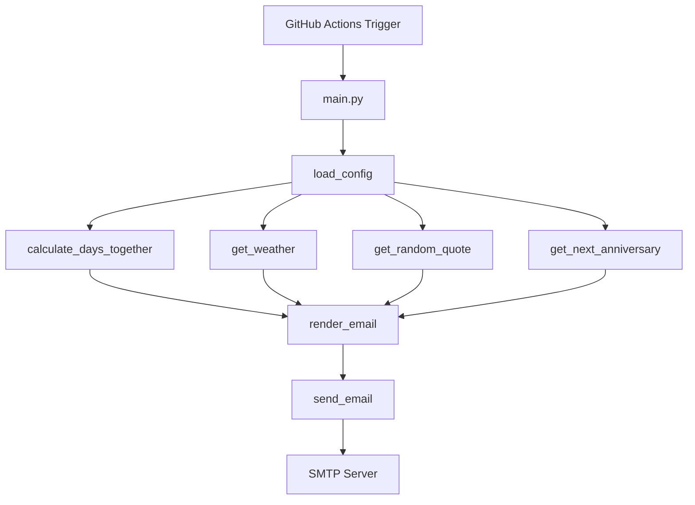

# CLAUDE.md - 每日恋爱邮件项目

> **生成时间**: 2026-03-06T16:54:49Z  
> **版本**: 初始版本  
> **维护者**: AI Assistant

---

## 项目概述

**每日恋爱邮件** 是一个基于 Python 的自动化邮件发送项目，通过 GitHub Actions 定时执行，每天为伴侣发送包含恋爱天数、天气预报、每日情话和纪念日提醒的温暖邮件。

**技术栈**: Python 3.10+ · GitHub Actions · SMTP · OpenWeatherMap API

---

## 项目结构

```
auto-email/
├── src/                    # 核心源代码
│   ├── main.py            # 入口点 - 工作流编排
│   ├── config.py          # 配置管理
│   ├── email_sender.py    # 邮件发送
│   ├── template.py        # 模板渲染
│   ├── calculator.py      # 恋爱天数计算
│   ├── anniversary.py     # 纪念日处理
│   ├── weather.py         # 天气获取
│   ├── quotes.py          # 每日情话
│   ├── background.py      # 背景处理
│   ├── performance.py     # 性能监控
│   └── monitoring.py      # 运行监控
├── tests/                 # 单元测试 (pytest)
├── scripts/               # 辅助脚本
│   └── generate_email.py  # 邮件预览生成
├── templates/             # Jinja2 邮件模板
├── assets/                # 静态资源 (图片等)
├── data/                  # 数据文件
│   └── quotes.json        # 情话库
├── docs/                  # 项目文档
├── .github/workflows/     # GitHub Actions 配置
│   └── daily-email.yml    # 定时任务
├── config.yaml            # 本地运行配置
├── config.yaml.example    # 配置示例
├── requirements.txt       # Python 依赖
└── README.md              # 项目说明
```

---

## 模块导航

### 核心模块

| 模块 | 文件 | 职责 | 关键函数 |
|------|------|------|----------|
| 主入口 | `src/main.py` | 工作流编排 | `main()` |
| 配置管理 | `src/config.py` | 加载 YAML/环境变量配置 | `load_config()` |
| 邮件发送 | `src/email_sender.py` | SMTP 邮件发送 | `send_email()` |
| 模板渲染 | `src/template.py` | Jinja2 模板处理 | `render_email()` |
| 天数计算 | `src/calculator.py` | 计算恋爱天数/月数/年数 | `calculate_days_together()` |
| 纪念日 | `src/anniversary.py` | 查找下一个纪念日 | `get_next_anniversary()` |
| 天气获取 | `src/weather.py` | OpenWeatherMap API 调用 | `get_weather()` |
| 每日情话 | `src/quotes.py` | 随机选择情话 | `get_random_quote()` |

### 测试模块

| 测试文件 | 测试目标 |
|----------|----------|
| `tests/test_calculator.py` | 恋爱天数计算逻辑 |
| `tests/test_anniversary.py` | 纪念日处理逻辑 |
| `tests/test_weather.py` | 天气 API 调用 |
| `tests/test_quotes.py` | 情话获取 |
| `tests/test_email_sender.py` | 邮件发送功能 |
| `tests/test_config.py` | 配置加载 |
| `tests/test_background.py` | 背景处理 |
| `tests/test_workflow.py` | 完整工作流 |

---

## 架构流程图



---

## 开发规范

### 代码风格
- 遵循 PEP 8 规范
- 使用类型注解 (Type Hints)
- 模块导入使用 try/except 提供 fallback
- 日志使用标准 logging 模块

### 错误处理模式
```python
def safe_call(func, *args, **kwargs):
    """安全调用函数，处理 TypeError 签名不匹配"""
    if not callable(func):
        return None
    try:
        return func(*args, **kwargs)
    except TypeError:
        try:
            return func()
        except Exception as e:
            log.error("Function call failed: %s", e)
            return None
```

### 配置管理
- 本地开发: `config.yaml`
- GitHub Actions: 环境变量 / Secrets
- 支持 fallback 机制

---

## 运行方式

### 本地测试
```bash
# 干运行（不发送邮件）
python src/main.py --dry-run

# 发送测试邮件
python src/main.py --test-email your@email.com

# 生成邮件预览
python scripts/generate_email.py --open
```

### 运行测试
```bash
pytest tests/
```

---

## GitHub Actions 配置

**触发条件**:
- 定时: 每天 UTC 08:00 (北京时间 16:00)
- 手动: workflow_dispatch

**Secrets 配置**:
| Secret | 说明 |
|--------|------|
| EMAIL_SENDER | 发件人 QQ 邮箱 |
| EMAIL_PASSWORD | QQ 邮箱授权码 |
| EMAIL_RECIPIENT | 收件人邮箱 |
| WEATHER_API_KEY | OpenWeatherMap API Key |
| LOVE_START_DATE | 恋爱起始日期 (YYYY-MM-DD) |
| CITY | 目标城市（英文） |
| ANNIVERSARIES | 纪念日 JSON 列表 |

---

## 注意事项

1. **安全性**: config.yaml 包含敏感信息，已加入 .gitignore
2. **API 限制**: OpenWeatherMap 免费版每日 1000 次调用
3. **时区**: 默认 Asia/Shanghai
4. **邮件模板**: 支持多套模板切换 (email/email_new)

---

## 扩展指南

### 添加新数据源
1. 在 `src/` 下创建新模块
2. 实现数据获取函数
3. 在 `main.py` 中集成调用
4. 更新模板使用新数据

### 添加新模板
1. 在 `templates/` 下创建 `.html` 文件
2. 使用 Jinja2 语法
3. 在 config.yaml 中配置 `app.template`

---

*本文档由 AI 自动生成，随项目迭代更新*
